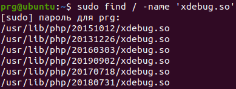
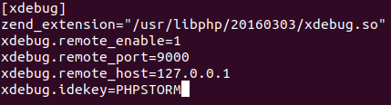

# Установка и настройка Xdebug + PHPStorm в Ubuntu 20.04 / Astra Linux 
Здесь рассказано и показано как настроить Xdebug в системах основанных на Ubuntu. Коснёмся так же особенностей работы в Astra Linux 1.6 и выше

## Установка Xdebug 

    sudo apt install php-xdebug
    
Данная команда автоматически определит какой у вас php и подтянет нужный дебагер из репозитория
## Ищем путь к файлу xdebug.so 
Ищем путь к so файлу установленного xdebug командой:

    sudo find / -name 'xdebug.so'
   
Варианты вывода могут быть такие: 

    /usr/lib/php/20121212/xdebug.so   <—— для PHP5.5
    /usr/lib/php/20131226/xdebug.so   <—— для PHP5.6
    /usr/lib/php/20160303/xdebug.so   <—— для PHP7.0
    /usr/lib/php/20151012/xdebug.so   <—— для PHP7.1   
    
У меня это выглядело так:

    

## Редакутируем php.ini
Открываем файл sudo vi /etc/php/X.X/apache2/php.ini где X.X версия установленного у вас PHP.  Например для PHP-7.0  путь будет таким /etc/php/7.0/apache2/php.ini

    sudo vi /etc/php/7.0/apache2/php.ini
    
В самом конце пишем:

    [xdebug]
    ; путь к файлу so
    zend_extension="/usr/lib/php/20160303/xdebug.so"
    ; остальные обязательные параметры
    xdebug.remote_enable=1
    xdebug.remote_port=9000
    xdebug.remote_host=127.0.0.1
    xdebug.idekey=PHPSTORM
    
Это может выглядеть так: 

Перезагружаем apache

    sudo service apache2 restart    
